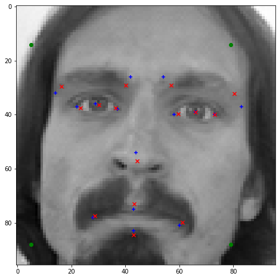
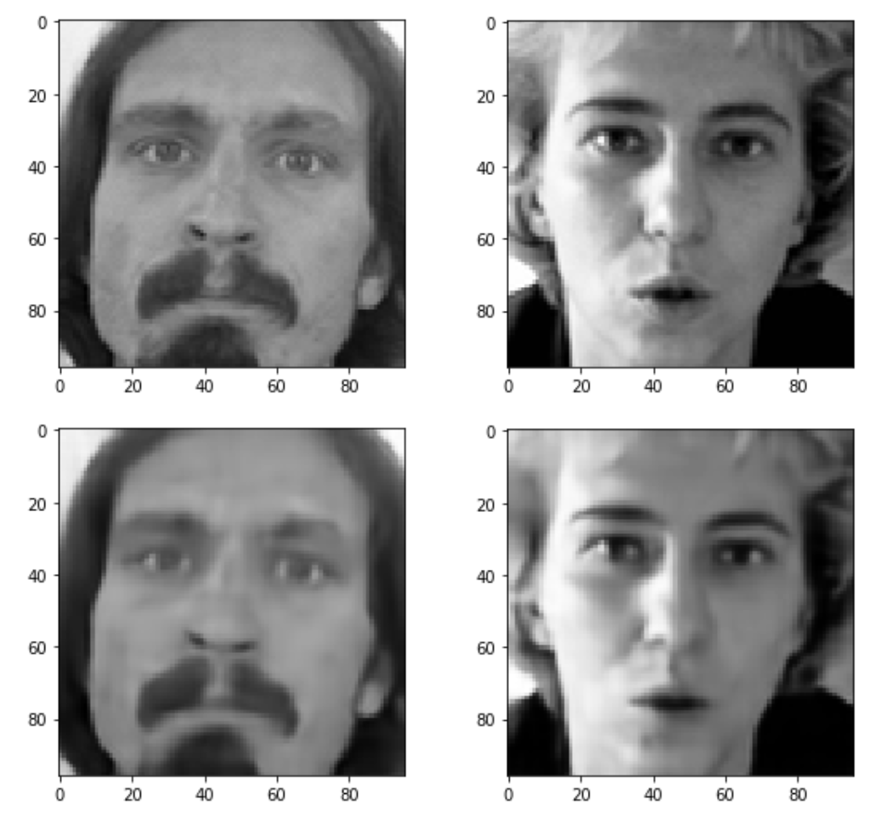

# Facial Landmarks
Facial Landmark Detection using Kaggle Competition Training Data

#### Facial_Landmarks.ipynb
In the facial landmarks notebook I experimented with using DLib's facial landmark detector as a tool for filling in the missing datapoints from the Kaggle dataset.  Dlibs landmarks are shown as blue in the following image, with red denoting the original Kaggle dataset.  Note: for eye centres I average the four Dlib landmarks that surround each eye.

#### Facial_Autoencoder.ipynb
This notebook uses the images from both the train and test csv files to train a simple autoencoder, sharing the similar encoder layers from the previous notebook but stopping at a minimum dimension of 12x12.  

